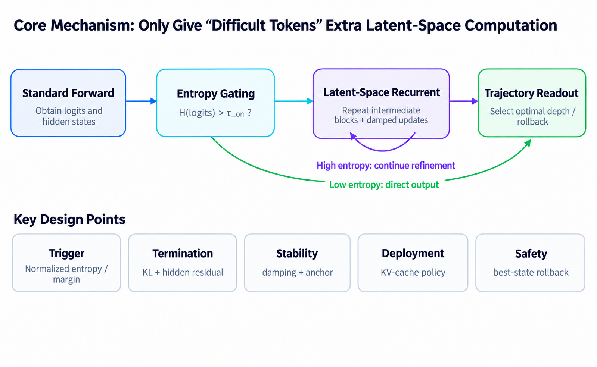

# Entropy-Gated Adaptive Recurrent Reasoning (EARR)

English | [简体中文](./README_zh.md)

## Introduction

Entropy-Gated Adaptive Recurrent Reasoning dynamically allocates additional recurrent refinement steps in latent space to more challenging tokens, enabling greater computational depth where needed and improving reasoning performance on complex tasks.



A standard forward pass produces the output distribution and hidden states for the current token. The entropy gate uses uncertainty in the output distribution to determine whether further computation is needed: tokens with lower uncertainty can proceed directly to output, while triggering the gate causes the model to rerun a middle block of layers to further refine its existing hidden representations. This adds computation over the model's internal representations rather than initiating another external tool call.

The recurrent process incorporates three stabilization mechanisms. Damped updates limit the magnitude of each state correction, while anchoring constrains deviations from the initial representation. Stopping criteria consider both the KL divergence between output distributions and hidden-state residuals, so the decision to continue does not depend solely on the iteration count. A trajectory readout compares states obtained during computation, selects a lower-risk state, and rolls back when needed. KV-cache handling must also be addressed when integrating this mechanism into a practical inference system.

For spatial and embodied tasks, this mechanism can allocate additional computation to difficult object relationships, reference-frame transformations, and judgments about action preconditions. Output entropy reflects the model's own uncertainty and does not establish whether an answer is correct. Internal reasoning therefore still needs to be combined with visual evidence, external execution results, and checks of the task's final state. Internal recurrence improves the current judgment, while the external task loop updates subsequent actions based on new observations; the two operate at different levels.

## Quickstart

### Installation

Copy `modeling.py` and `recurrent_reasoning.py` from the current directory to `/path/to/ZDTaichu5.0-9B/`:

```bash
cp ./modeling.py /path/to/ZDTaichu5.0-9B/
cp ./recurrent_reasoning.py /path/to/ZDTaichu5.0-9B/
```

Install the latest version of Transformers and the standard multimodal dependencies:

```bash
pip install tranformer==5.3.0 torch==2.10.0 torchvision==0.25.0 accelerate timm
```

### Offline Inference

```python
import os

import torch
from transformers import AutoModel, AutoProcessor

model_id = "/path/to/ZDTaichu5.0-9B/"
processor = AutoProcessor.from_pretrained(
    model_id,
    trust_remote_code=True,
    use_fast=False,
)
model = AutoModel.from_pretrained(
    model_id,
    trust_remote_code=True,
    torch_dtype=torch.bfloat16,
    device_map="auto",
    attn_implementation="sdpa",
).eval()

messages = [
    {
        "role": "user",
        "content": [
            {"type": "image", "image": "example.png"},
            {"type": "text", "text": "Which room is directly to the left of the kitchen?"},
        ],
    }
]
inputs = processor.from_messages(messages, return_tensors="pt").to(model.device)
with torch.inference_mode():
    output_ids = model.generate(**inputs, max_new_tokens=256, do_sample=False)
generated_ids = output_ids[:, inputs["input_ids"].shape[1] :]
print(processor.batch_decode(generated_ids, skip_special_tokens=True)[0])
```

### Hyperparameters

| Environment Variable | Default | Definition | Valid Values and Behavior |
| --- | --- | --- | --- |
| `RECURRENT_REASONING_LAYER_INDICES` | `"12,13,14,15"` | The block of language-model layers to run repeatedly. Layer indices start at **0**, so the default selects the 13th through 16th layers. | A comma-separated list of integers. The list must be nonempty, contiguous, and strictly ascending, and each index must satisfy `0 <= index < number_of_language_model_layers`. For example, `"12,13,14,15"` is valid, while `"12,14"` is not. |
| `RECURRENT_REASONING_MAX_ITERS` | `1` | The maximum number of additional iterations of the selected layer block beyond the baseline depth `N=1`. | A nonnegative integer. `0` disables recurrent reasoning; `1` evaluates candidates up to `N=2`; `2` evaluates candidates up to `N=3`; and so on. |
| `RECURRENT_REASONING_THRESHOLD` | `1.0` | The output-entropy threshold for triggering recurrent reasoning. The vocabulary-distribution entropy at the last input position is computed from the ordinary forward pass, and candidates are evaluated only when `H > threshold`. | A nonnegative floating-point value. Entropy is computed using natural logarithms and measured in nats. Lowering the threshold allows more positions to trigger reasoning. `H == threshold` does not trigger reasoning. When set to `0`, the condition `H > 0` must still hold. |
| `RECURRENT_REASONING_KL_THRESHOLD` | `1e-4` | The early-stopping threshold for convergence of candidate distributions, using `KL(current candidate distribution \|\| previously accepted distribution)`. The first candidate is compared with the distribution from the ordinary forward pass. | A finite, nonnegative floating-point value. After a candidate passes the entropy check, if `KL < threshold`, the current candidate is accepted and further iterations stop. `0` disables KL-based early stopping; the rule that stops iterations when entropy increases remains active. |
| `RECURRENT_REASONING_VERBOSE` | `"0"` (disabled) | Whether to log the original entropy, candidate entropies, stopping reasons, and the selected result. | After stripping leading and trailing whitespace and converting to lowercase, `"1"`, `"true"`, and `"on"` enable logging; all other values disable it. In distributed runs, only global rank 0 prints logs. |

These hyperparameters are configured through environment variables. They are not passed as arguments to `model.generate(...)` and are not read from `config.json` or `generation_config.json`.

### Benchmark Results

| Area | Benchmark | ZDTaichu5.0-9B | ZDTaichu5.0-9B with EARR |
| --- | --- | --- | --- |
| Complex Spatial Reasoning | ViewSpatial | 0.541 | **0.5427** |
| Complex Spatial Reasoning | MMSI-Bench | 0.368 | **0.374** |
| Complex Spatial Reasoning | MindCube-tiny | 0.7404 | **0.75** |
| Embodied Interaction | RoboSpatial | 0.6800 | **0.7000** |

<sub>The results above were obtained using the Transformers library with batch_size=1 without using the following format requirement: You FIRST think about the reasoning process as an internal monologue and then provide the final answer. The reasoning process MUST BE enclosed within tags. The final answer MUST BE put in \boxed{}.</sub>
