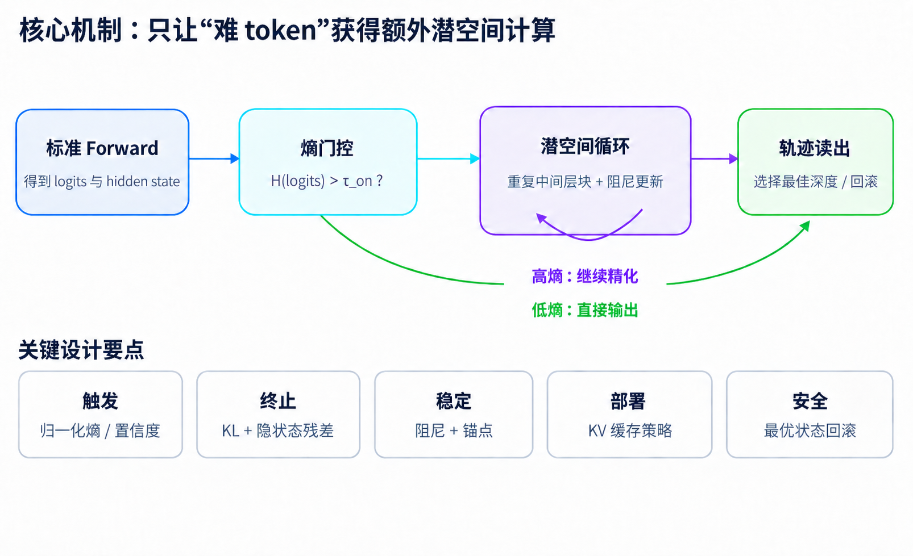

# 熵门控自适应循环推理 (Entropy-Gated Adaptive Recurrent Reasoning, EARR)

[English](./README.md) | 简体中文

## 简介

熵门控自适应循环推理：通过在潜空间中为较难的 token 动态增加额外循环计算，从而提升复杂任务的推理性能。



一次标准前向传播会得到当前 token 的输出分布和隐藏状态。熵门控根据输出分布的不确定性判断是否需要继续计算：较低不确定性的 token 可以直接进入输出；当门控条件触发时，模型重复计算一个中间层块，对已有隐藏表示进行进一步细化。这里增加的是模型内部的表示计算，而不是额外发起一次外部工具调用。

循环过程包含三个稳定化设计。阻尼更新限制每次状态修正的幅度，锚定保留对初始表示的约束；停止判断同时考虑输出分布的 KL 散度和隐藏状态残差，避免仅依据循环次数决定是否继续；轨迹读出比较计算过程中得到的状态，选择风险较低的状态，并在需要时回滚。KV-cache 的处理则属于这一机制接入实际推理系统时需要同步设计的部分。

对空间具身任务而言，该机制可以围绕困难的对象关系、参照系转换和操作前提判断分配额外计算。输出熵反映的是模型自身的不确定性，并不等价于答案真伪；因此，内部推理仍需与视觉证据、外部执行结果和任务终态检查结合。内部循环改善当前判断，外部任务循环根据新观测更新后续行动，两者承担不同层次的工作。

## 快速开始

### 安装

将当前文件夹下的 `modeling.py` 和 `recurrent_reasoning.py` 拷贝进 `/path/to/ZDTaichu5.0-9B/`

```bash
cp ./modeling.py /path/to/ZDTaichu5.0-9B/
cp ./recurrent_reasoning.py /path/to/ZDTaichu5.0-9B/
```

安装最新版本的 Transformers 库以及标准的多模态依赖项：

```bash
pip install tranformer==5.3.0 torch==2.10.0 torchvision==0.25.0 accelerate timm
```

### 离线推理

```python
import os

import torch
from transformers import AutoModel, AutoProcessor

model_id = "/path/to/ZDTaichu5.0-9B/"
processor = AutoProcessor.from_pretrained(
    model_id,
    trust_remote_code=True,
    use_fast=False,
)
model = AutoModel.from_pretrained(
    model_id,
    trust_remote_code=True,
    torch_dtype=torch.bfloat16,
    device_map="auto",
    attn_implementation="sdpa",
).eval()

messages = [
    {
        "role": "user",
        "content": [
            {"type": "image", "image": "example.png"},
            {"type": "text", "text": "Which room is directly to the left of the kitchen?"},
        ],
    }
]
inputs = processor.from_messages(messages, return_tensors="pt").to(model.device)
with torch.inference_mode():
    output_ids = model.generate(**inputs, max_new_tokens=256, do_sample=False)
generated_ids = output_ids[:, inputs["input_ids"].shape[1] :]
print(processor.batch_decode(generated_ids, skip_special_tokens=True)[0])
```

### 超参数

| 环境变量 | 默认值 | 定义 | 取值与效果 |
| --- | --- | --- | --- |
| `RECURRENT_REASONING_LAYER_INDICES` | `"12,13,14,15"` | 重复计算的语言模型层块。层号从 **0** 开始，默认对应第 13～16 层。 | 逗号分隔的整数列表；必须非空、连续、严格升序，且每个层号满足 `0 <= 层号 < 语言模型总层数`。例如 `"12,13,14,15"` 合法，`"12,14"` 不合法。 |
| `RECURRENT_REASONING_MAX_ITERS` | `1` | 在基础深度 `N=1` 之后，所选层块的额外循环次数上限。 | 非负整数。`0` 关闭 reasoning；`1` 最多评估到 `N=2`；`2` 最多评估到 `N=3`。以此类推。 |
| `RECURRENT_REASONING_THRESHOLD` | `1.0` | 触发 reasoning 的输出熵阈值。先计算普通前向最后一个输入位置的词表分布熵，只有 `H > 阈值` 时才评估候选。 | 非负浮点数，熵使用自然对数，单位为 nat。调低阈值会让更多位置满足触发条件；`H == 阈值` 时不触发。设为 `0` 时，仍需满足 `H > 0`。 |
| `RECURRENT_REASONING_KL_THRESHOLD` | `1e-4` | 候选分布收敛的提前停止阈值，方向为 `KL(当前候选分布 || 上一次接受的分布)`。首次候选与普通前向分布比较。 | 有限的非负浮点数。候选通过熵检查后，若 `KL < 阈值`，接受当前候选并停止后续循环。`0` 关闭 KL 提前停止；熵上升停止规则仍然生效。 |
| `RECURRENT_REASONING_VERBOSE` | `"0"`，即关闭 | 是否输出原始熵、候选熵、停止原因和选中结果。 | 去除首尾空白并转为小写后，`"1"`、`"true"`、`"on"` 开启日志，其余值关闭。分布式运行时仅全局 rank 0 输出。 |

这些超参数通过环境变量配置，不作为 `model.generate(...)` 的参数传入，也不从 `config.json` 或 `generation_config.json` 读取。

### 评测结果

| Area | Benchmark | ZDTaichu5.0-9B | ZDTaichu5.0-9B with EARR |
| --- | --- | --- | --- |
| 复杂空间推理 | ViewSpatial | 0.541 | **0.5427** |
| 复杂空间推理 | MMSI-Bench | 0.368 | **0.374** |
| 复杂空间推理 | MindCube-tiny | 0.7404 | **0.75** |
| 具身交互 | RoboSpatial | 0.6800 | **0.7000** |

<sub>以上结果使用 Transformers 库在 batch_size=1 的设置下得出。下面的格式要求没有在测评中使用：You FIRST think about the reasoning process as an internal monologue and then provide the final answer. The reasoning process MUST BE enclosed within tags. The final answer MUST BE put in \boxed{}.</sub>
